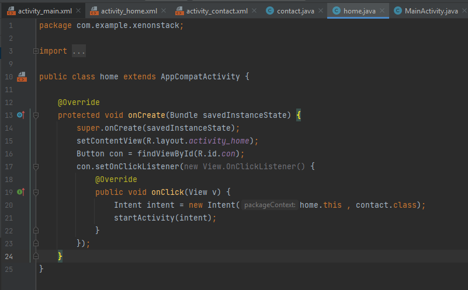
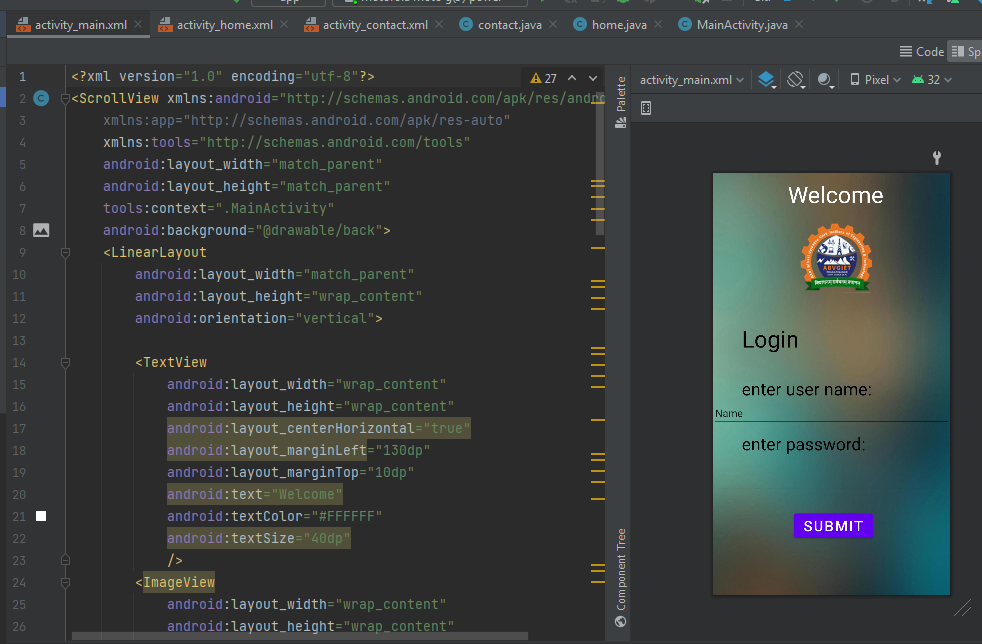

# Xenonstack-Tech-Round
Technical round for Xenon stack
## I have uploaded the app folder which consistes of the app for xenonstack coding round.the app consists of 3 main pages which are developed using xml programming and java language is used for backend implementation.

